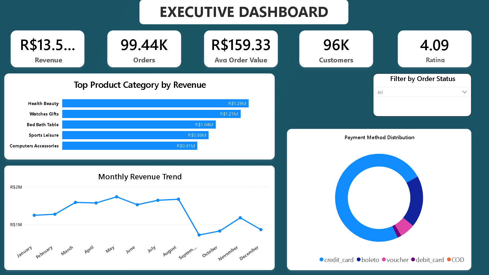
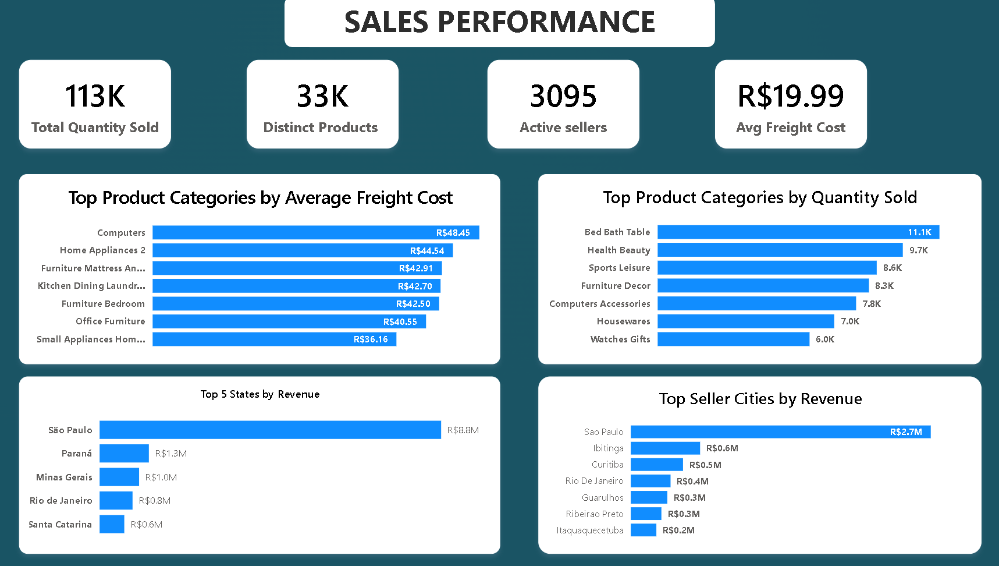
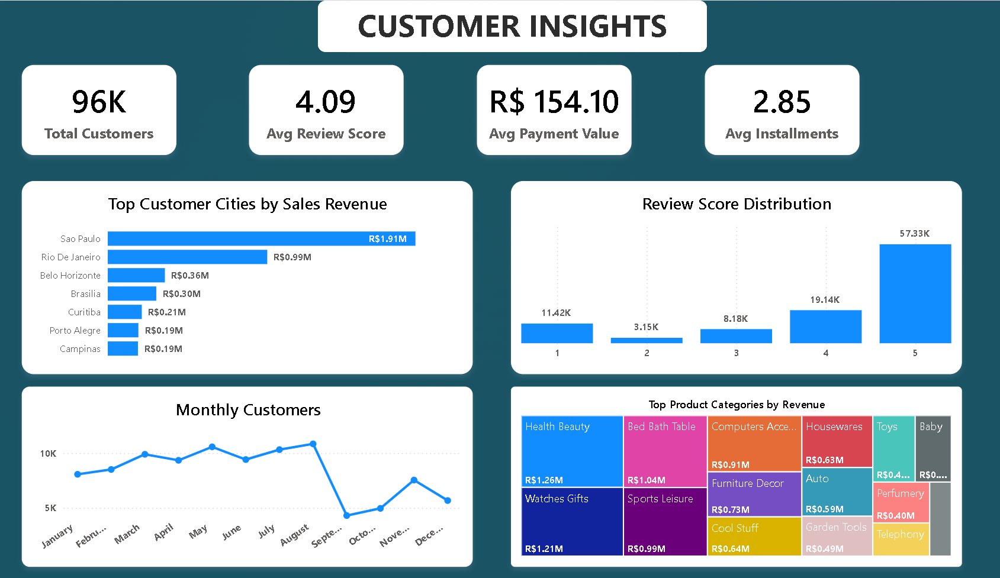
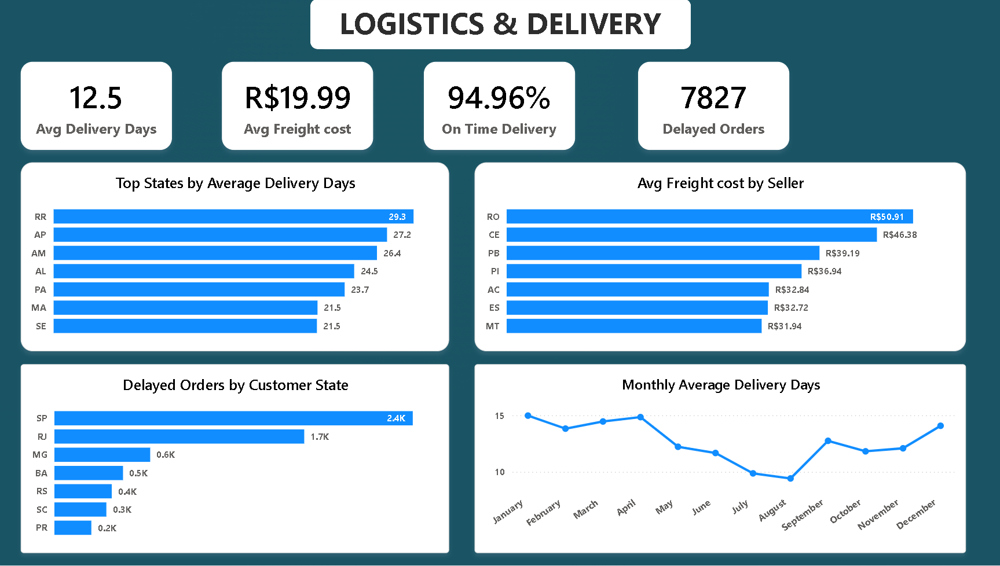

# Olist E-Commerce Sales & Customer Analytics Dashboard

An end-to-end Power BI project built using the Olist Brazilian E-Commerce dataset. This dashboard transforms raw transactional data into actionable business insights across sales, customer behavior, logistics, and executive KPIs.

---

## Project Overview

This project focuses on analyzing a multi-table e-commerce dataset to answer key business questions such as:

- Which product categories generate the highest revenue?
- Which cities contribute the most sales?
- How do customers behave over time?
- How efficient is the delivery process?
- Which states experience the highest delivery delays?

The dashboard was developed using Power BI with Power Query for data preparation, DAX for business calculations, and an optimized star schema data model.

---
## Features

- Interactive executive dashboard with key business KPIs
- Sales performance analysis across products and regions
- Customer behavior and review analysis
- Logistics and delivery performance monitoring
- Dynamic filtering using slicers
- Multi-page dashboard with drill-down capability
- Built using a star schema data model
- Custom DAX measures for business calculations


## Dashboard Preview
## Key Insights

- Health Beauty generated the highest revenue among all product categories.
- São Paulo contributed the largest share of total sales.
- Most customers rated their purchases 5 out of 5.
- Credit Card was the most frequently used payment method.
- Average delivery time remained around 12–15 days throughout the year.
- Delivery delays were concentrated in a few customer states, highlighting potential logistics bottlenecks.
## Dashboard Pages
### Executive Dashboard



---

### Sales Performance



---

### Customer Insights



---

### Logistics & Delivery


### Executive Dashboard
Provides a high-level overview of business performance including:

- Total Revenue
- Total Orders
- Average Order Value
- Customer Count
- Average Rating
- Monthly Revenue Trend
- Payment Method Distribution

---

### Sales Performance

Focuses on product and sales analysis.

Highlights include:

- Top Product Categories by Revenue
- Quantity Sold by Category
- Average Freight Cost
- Revenue by State
- Revenue by Seller City

---

### Customer Insights

Analyzes customer purchasing behavior.

Includes:

- Customer Distribution
- Review Score Analysis
- Monthly Active Customers
- Top Customer Cities
- Product Category Revenue

---

### Logistics & Delivery

Tracks operational efficiency.

Includes:

- Average Delivery Days
- On-Time Delivery Rate
- Delayed Orders
- Freight Cost by Seller State
- Monthly Delivery Trend
- Delivery Delays by Customer State

---
## Skills Demonstrated

- Data Cleaning
- Data Modeling
- Power Query (ETL)
- DAX Measures
- KPI Design
- Dashboard Design
- Business Intelligence
- Data Visualization

## Tools Used

- Power BI Desktop
- Power Query
- DAX
- Data Modeling
- Microsoft Excel

---

## Dataset

The dashboard uses the public **Olist Brazilian E-Commerce Dataset** available on Kaggle.

Dataset:https://www.kaggle.com/datasets/olistbr/brazilian-ecommerce

---

## Repository Structure

```
powerbi-olist-ecommerce-dashboard/
│
├── Olist_Ecommerce_Analytics.pbix
├── images/
├── dataset/
└── README.md
```

---

## Author

**Venkkateshan**

Aspiring Data Analyst with hands-on experience in Power BI, SQL, Python, Excel, and Machine Learning. Passionate about transforming raw data into meaningful business insights through interactive dashboards and analytics.
